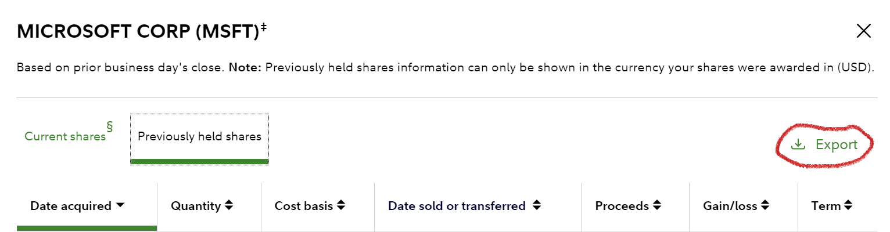

# tixtax

Just a utility to calculate some currency rates and gains.

1. Export transactions from Fidelity (you get a file called "View closed lots.csv")
1. Drop the file in the same folder as the notebook
1. Run the notebook, e.g. using GitHub Codespaces
1. The notebook *will use Norges Bank API to download the USD-NOK exchange rates* for purchase and sales dates
1. It *calculates your gains in NOK* from entry and exit prices using the daily rates
1. It *sums up your transactions* through the years.
1. You get an XLSX file you can submit to the tax authorities to show your calculations
1. Doublecheck stuff, then *doublecheck again*
1. Don't push your changes unless you want your tax report on GitHub (forks are public by default)

## Where to find the data

Export data from this place in Fidelity.

Use the Export button, the notebook will read and process the entire file.

## Remember

* Remember Norwegian tax law requires first-in-first-out when reporting, the notebook doesn't fix that for you.
* And that I'm not a tax lawyer. 
* And that this may have bugs.
* Norges Bank is missing currency rates for some days (IDK why), the next day (after) with data is then used.
* Norges Bank only has daily rates going back 10 years, for purchase dates before that the yearly avg is used.
* And that Fidelity or Norges Bank may change stuff year-over-year to break this, let me know or send a PR.